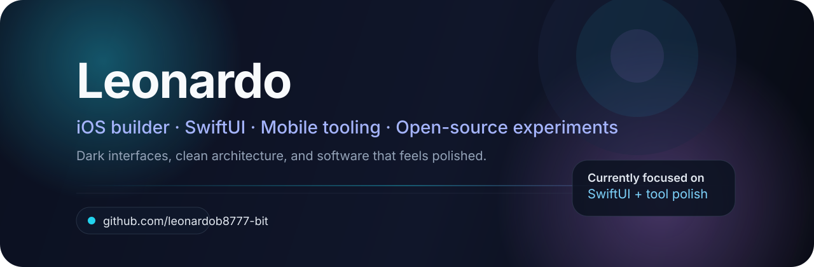

  

  iOS builder · SwiftUI · Mobile tooling · Open-source experiments

  <a href="https://leonardob8777-bit.github.io">Website</a> ·
  <a href="https://github.com/leonardob8777-bit?tab=repositories">Repositories</a>

## About

I build polished iOS experiences, clean SwiftUI interfaces, and practical tools for mobile workflows.
I like dark visual systems, simple architecture, and projects that feel useful from the first minute.

## What I Focus On

- Swift and SwiftUI
- Mobile UI and product polish
- Reusable app architecture
- Tooling, automation, and developer experience
- Clean, minimal, high-contrast design

## Featured Work

- [Eagle](https://github.com/leonardob8777-bit/Eagle)
- [Vendor](https://github.com/leonardob8777-bit/Vendor)
- [duck](https://github.com/leonardob8777-bit/duck)
- [leonardob8777-bit.github.io](https://github.com/leonardob8777-bit/leonardob8777-bit.github.io)

## Currently

- Refactoring and polishing interfaces
- Improving reusable components
- Keeping projects lean and maintainable
- Turning ideas into something shippable

## Tech Stack

`Swift` `SwiftUI` `UIKit` `Objective-C` `C` `Xcode` `Git` `macOS`

## Contact

If you want to collaborate on iOS, UI, or tooling, the website above is the easiest place to start.
